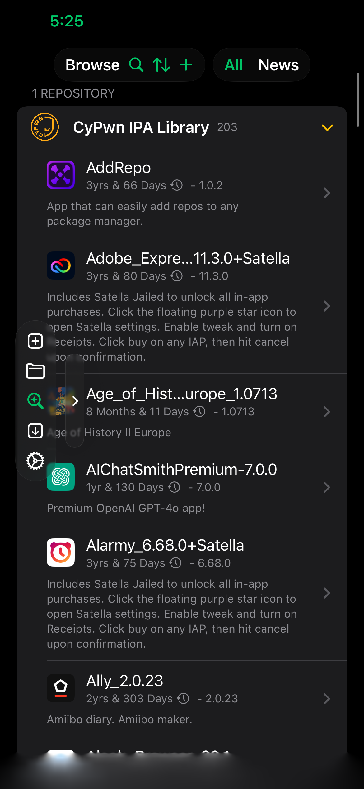
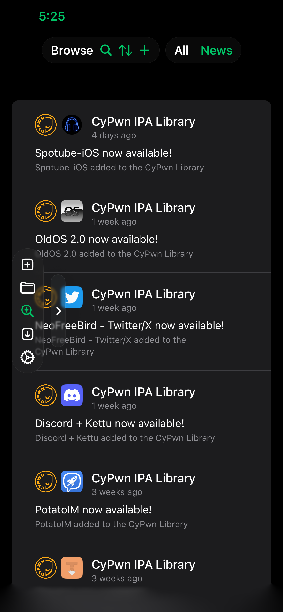
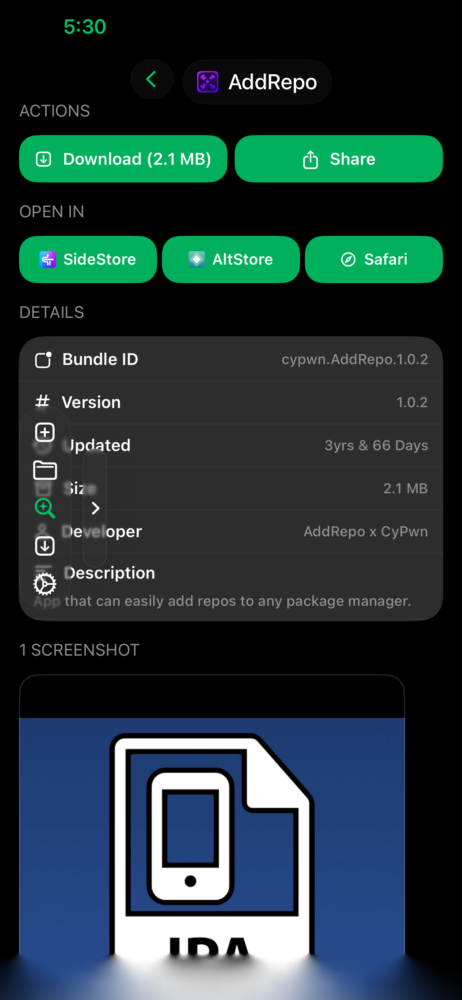
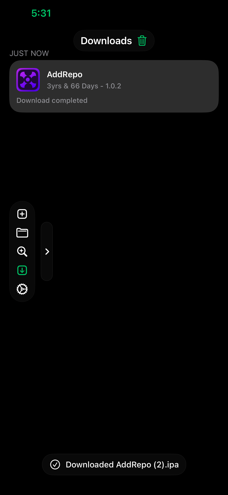

updating for liquid glass and finishing ui merge

# MySign

The coolest ipa signer on the planet, for iOS 15 to 26. 

## Installation
Download the ipa from [releases](https://github.com/gliddd4/MySign/releases) and upload it to [a web signer](https://sign.ipasign.cc/) along with your certificate. If the app crashes use the linked web signer.

## Credits

- [ArkSigning](https://github.com/nabzclan-reborn/ArkSigning): Improved zsign fork for on device signing and ipa modification
- [Circlefy](https://github.com/AppInstalleriOSGH/Circlefy): Allows for transparent/circle cropped app icons
- [Santander](https://github.com/NSAntoine/Santander): Modern Filza alternative 
- [Feather](https://github.com/khcrysalis/Feather): Ipa signer used only for importing eSign repos (MySign is not a Feather fork)

## Screenshots

  
  

  
  

## License
You can use the code however you want
